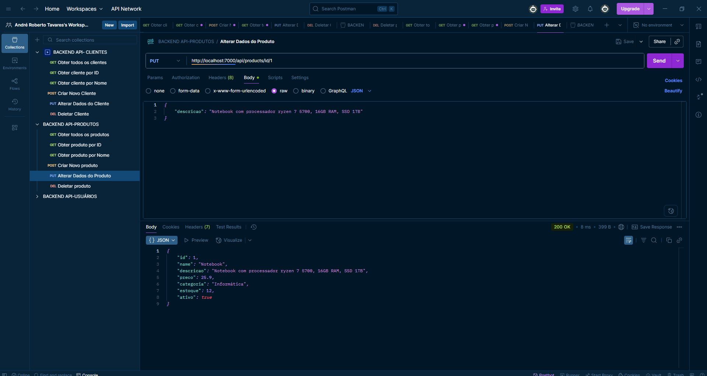

# API de Clientes e Produtos

Este projeto apresenta uma API RESTful robusta para gerenciamento de clientes e produtos, desenvolvida em Node.js e Express.js. A API oferece um conjunto completo de operações CRUD (Create, Read, Update, Delete) para ambas as entidades, sendo ideal para servir como backend em aplicações de e-commerce, sistemas de gerenciamento de estoque ou qualquer plataforma que necessite de manipulação eficiente de dados de clientes e produtos.

## Funcionalidades da API

A API é dividida em dois módulos principais: **Clientes** e **Produtos**, cada um com suas próprias rotas e funcionalidades específicas. Abaixo, detalhei as operações disponíveis para cada módulo, ilustradas com exemplos de requisições e respostas.

### API de Clientes

#### 1. Obter todos os clientes (GET /api/clients)

Esta rota permite listar todos os clientes cadastrados na base de dados.

#### 2. Obter cliente por ID (GET /api/clients/:id)

Retorna os detalhes de um cliente específico, utilizando seu ID como parâmetro.

#### 3. Obter cliente por Nome (GET /api/clients/name/:name)

Permite buscar clientes pelo nome, retornando todos os registros que correspondem ao nome fornecido.

#### 4. Criar Novo Cliente (POST /api/clients)

Adiciona um novo cliente à base de dados. É necessário fornecer os dados do cliente no corpo da requisição.

#### 5. Alterar Dados do Cliente (PUT /api/clients/:id)

Atualiza as informações de um cliente existente, identificado pelo seu ID.

#### 6. Deletar Cliente (DELETE /api/clients/:id)

Remove um cliente da base de dados, utilizando seu ID como referência.

### API de Produtos

#### 1. Obter todos os produtos (GET /api/products)

Esta rota permite listar todos os produtos cadastrados na base de dados.

#### 2. Obter produto por ID (GET /api/products/:id)

Retorna os detalhes de um produto específico, utilizando seu ID como parâmetro.

#### 3. Obter produto por Nome (GET /api/products/name/:name)

Permite buscar produtos pelo nome, retornando todos os registros que correspondem ao nome fornecido.

#### 4. Criar Novo Produto (POST /api/products)

Adiciona um novo produto à base de dados. É necessário fornecer os dados do produto no corpo da requisição.

#### 5. Alterar Dados do Produto (PUT /api/products/:id)

Atualiza as informações de um produto existente, identificado pelo seu ID.

#### 6. Deletar Produto (DELETE /api/products/:id)

Remove um produto da base de dados, utilizando seu ID como referência.

## Tecnologias

*   Node.js
*   Express.js
*   JavaScript
*   JSON
*   Git
*   GitHub

## Autor

[Andre RT](https://www.linkedin.com/in/andr%C3%A9-roberto-tavares-03a36b316/)
